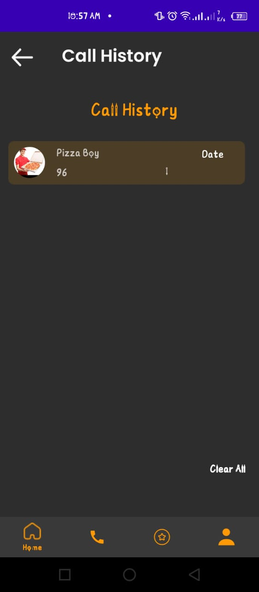

# Fake Call Android App

**Fake Call Android App** is a feature-rich Android application that provides users with a customizable fake calling experience. This app allows users to schedule and customize fake calls, including the caller's name, image, and contact information retrieved from the phone. The app is designed with **service** and **broadcast receivers** to function seamlessly, even when the app is not in the foreground. Additionally, it includes settings, navigation drawer, and bottom navigation for smooth navigation, along with ad integration for monetization.

---

## **Features**

- **Customizable Fake Call Screen**  
  - Users can customize the caller's profile (name, image, and contact details).  
  - Fake call screens are dynamically generated based on user input.

- **Call Scheduling**  
  - Schedule fake calls at different times using an intuitive time selector.  
  - Fake calls work even when the app is in the background, powered by **services** and **broadcast receivers**.

- **Ad Integration**  
  - Integrated with **Rewarded Ads** and **Banner Ads** for monetization practice.  

- **Call History (Pending)**  
  - A feature to save and display the history of fake calls is under development.

- **Bottom Navigation & Navigation Drawer**  
  - Smooth navigation experience using **Bottom Navigation** for primary tabs and **Navigation Drawer** for settings and additional options.

- **Settings Screen**  
  - Customize app behavior and preferences via a dedicated settings screen.

---

## **Project Highlights**

- **Service and Broadcast Receiver Implementation**  
  The app uses Android's `Service` and `BroadcastReceiver` to handle fake calls seamlessly, even when the app is closed or minimized.

- **Dynamic UI**  
  Fake call screens and profiles are dynamically generated based on user input, providing a highly customizable experience.

- **Ad Integration**  
  Practiced implementing and managing **Rewarded Ads** and **Banner Ads** for user engagement and monetization.

- **Work in Progress**  
  This app is still under development, with features like call history and advanced customization pending completion.

- **Beginner Level Code**  
  As my first app, the coding level reflects a beginner's approach but demonstrates learning and practical implementation of Android concepts.

---
## **Note**

This is my first project, made for practice, and is currently under development.

---
## **How to Use**

1. **Clone the Repository**  
   ```bash
   git clone https://github.com/muhammaduthman688/Fake-Call-Android-App.git

---
## **Contact me**
[](https://wa.me/923472554151) [](mailto:muhammadusman688@gmail.com)


---
## **Screenshots**

### Main Screen


### Navigation Drawer


### Caller Information


### Character Screen


### Schedule Screen


### Caller History


### Advanced Settings


### Settings


